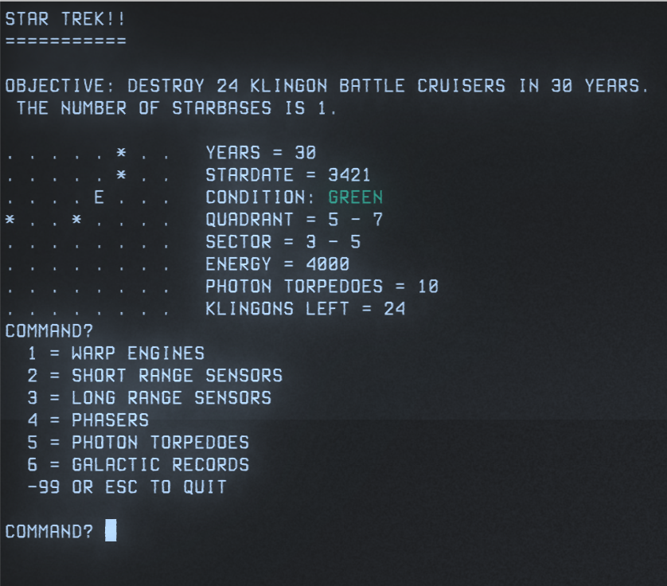

# StarTrust

_A ridiculous revivification of a game from 1978
(or maybe 1976, or maybe 1967)_

## The What
StarTrust is a rewrite of a "classic" computer game from 1978 called "Star Trek",
originally written in incomprehensible BASIC, in more comprehensible
(currently rather messy) Rust.

It's a text game, so loosely based on the TV Series/Franchise that
it essentially has nothing to do with it except colorful nomenclature.
These days, one would probably think of it as a "roguelike", but Rogue
had not been written by this time, so it was just a game that you play
in one sitting with perma-death that is a challenge to win (and is
turn based and character mode).

The game underwent a series of mutations, evolving into "Super Star Trek",
with many more features (everything was kind of unofficially open source
at the time, so people modified stuff and improved it constantly, but
there was no github either, so everything was effectively a fork).

I first became aware of the game only a few years after it was written (because,
I am *ancient*), and I bought the now legendary ["BASIC COMPUTER GAMES"
book, by David Ahl](https://archive.org/details/basic-computer-games-microcomputer-edition),
which had a source code listing in tiny type.

I stopped playing when Rogue (the most roguelike roguelike!) appeared,
and then I played its various descendants, but I remembered "Star Trek"
as being fun.

During this time, Bob Sorem did some rewriting, and he produced
[a C version](http://www.bobsoremweb.com/startrek.html).
It is this C version that I actually used as my template.

The game live on in the ["BSD Games" package](ps://wiki.linuxquestions.org/wiki/BSD_games),
with many of its contemporaries. It has aged less badly than most of those
games, and can actually even be fun.

## The How

I decided, as I described above, to rewrite the C version in Rust. This
version is more readable and less monstrously written than the BASIC
version, but also has a more minimalist feature set.

The approach that a reasonable person would take to this would be to
read the entire sources (all in one `.c` file, actually), understand it,
and begin with a blank slate.

I didn't do that. It shows. I didn't have the patience

What I did "in order to save time" (yeah, right) was subdivide it into
sections and try to do a naïve rewrite of just that section into something
closer to comprehensible, then worked with that.

That worked, but took quite a while.

The extant Rust code is pretty terrible and continues to be full of
vestigial garbage, but it produced a playable game, and so I played it
and found, to my shock, that it was *kind of* fun.

To play the game, you can just do `cargo run`, or you can build the
application and run that (why no, I have not built binaries for your
platform, thank you for asking). I don't know if it will work on
your platform (it should), but I will cheerfully take PRs if you
are a person of such character that you would create a PR for a
game from 1978 or whatever.

## The Why

I felt like it. I can't really explain it. I was having a _very_ difficult
time in my life, and this felt like something that I could do to clear
my mind and help me through.

I always liked this game, and I felt as if revivifying it would be
fun for everyone, and maybe even inspiring. And it was (see below)!

Surprisingly, as I sat down to write this README, I discovered that
[Emanuele Bolognesi rewrote it in Lua](https://emabolo.com/article/i-rewrote-the-1978-text-only-super-star-trek-game)
a few months earlier
[and wrote a medium post about it](https://medium.com/@emabolo/i-rewrote-the-1978-star-trek-game-and-this-is-what-happened-f4425f8d586).
His rocks. You should play his.

Or just play the BSD Games one, or write one of your own.

## The Future

I wrote this, made it work, and played it a bunch. It is surprisingly
balanced and challenging without being frustrating, being full of 1978
BASIC magic.

But earlier I mentioned that I thought it might inspire me. That happened.

I began to formulate a modern game that was a new take on this old game,
a space based roguelike with nostalgic callbacks to this ancient
bit of code.

Because of this, I began to read about Rust game frameworks/Engines, specifically
[Bevy](https://github.com/bevyengine/bevy) & [Amethyst](https://github.com/amethyst/amethyst).
And I began to code up a (very minor) storm during the winter holidays.

I'll put a link to that **HERE** when I have something presentable.

But what are my plans for _StarTrust_?

Maybe nothing. Maybe I walk away. However:
* Because this Rust code is _really crappy_, I may fix it, and turn
 it into a nice, presentable resource for people who want to see a
 relatively simple game in Rust.
* I may rewrite *StarTrust* in Bevy or Amethyst, as a way to teach
 myself those frameworks, and as an example for people to look at.
* I may rewrite it in Bevy *and* Amethyst, and do a bakeoff!

But, probably I will do nothing.

We shall see.
